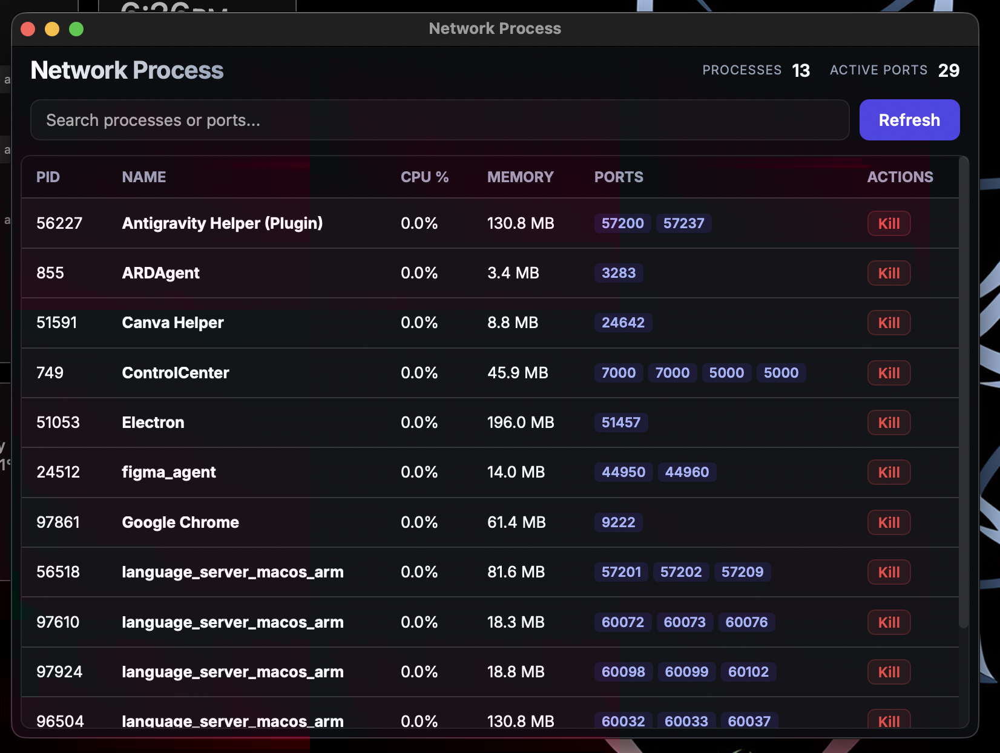

# Network Process



**Network Process** is an ultra-minimal, high-performance desktop application built with Rust and Tauri. It focuses exclusively on monitoring and managing system processes that have active network port listeners.

## Features

- **Port-Only Filtering**: Automatically filters out system noise to show only processes with active network connections (ideal for tracking local servers like Node.js, Python, or Nginx).
- **One-Click Termination**: Instantly kill any process directly from the dashboard.
- **Ultra-Minimal UI**: A data-dense, full-screen design with zero margins and distraction-free aesthetics.
- **Real-Time Updates**: Automatically refreshes the process list every 5 seconds.
## Downloads

Get the latest version (v0.5) for your platform:

- **macOS**: [Download .dmg](https://github.com/its-ash/network-process/releases/download/v-0.5/Network.Process_0.1.0_aarch64.dmg) | [Download .tar.gz](https://github.com/its-ash/network-process/releases/download/v-0.5/Network.Process_aarch64.app.tar.gz)
- **Windows**: [Download .exe](https://github.com/its-ash/network-process/releases/download/v-0.5/Network.Process_0.1.0_x64-setup.exe) | [Download .msi](https://github.com/its-ash/network-process/releases/download/v-0.5/Network.Process_0.1.0_x64_en-US.msi)
- **Linux**: [AppImage](https://github.com/its-ash/network-process/releases/download/v-0.5/Network.Process_0.1.0_amd64.AppImage) | [Debian (.deb)](https://github.com/its-ash/network-process/releases/download/v-0.5/Network.Process_0.1.0_amd64.deb) | [Red Hat (.rpm)](https://github.com/its-ash/network-process/releases/download/v-0.5/Network.Process-0.1.0-1.x86_64.rpm)

## Tech Stack

- **Backend**: [Rust](https://www.rust-lang.org/) & [Tauri v2](https://tauri.app/)
- **Frontend**: Vanilla JavaScript & CSS (Glassmorphism design system)
- **Monitoring**: `sysinfo` (Rust) & `lsof` (macOS/Unix)

## Getting Started

### Development
1. Install [Rust](https://www.rust-lang.org/tools/install) and [Tauri CLI](https://tauri.app/v1/guides/getting-started/prerequisites).
2. Clone the repository and install dependencies:
   ```bash
   npm install
   ```
3. Run the application in development mode:
   ```bash
   npm run tauri dev
   ```

## Troubleshooting (macOS)

If you encounter issues running the application on macOS (e.g., "damaged and can't be opened"), it might be due to macOS quarantine.

Try checking the attributes:
```bash
xattr -l /path/to/application.app
```

If `com.apple.quarantine` is listed, you can remove it with:
```bash
xattr -dr com.apple.quarantine /path/to/application.app
```
You might want to remove other attributes it returns as well.

## License
MIT
