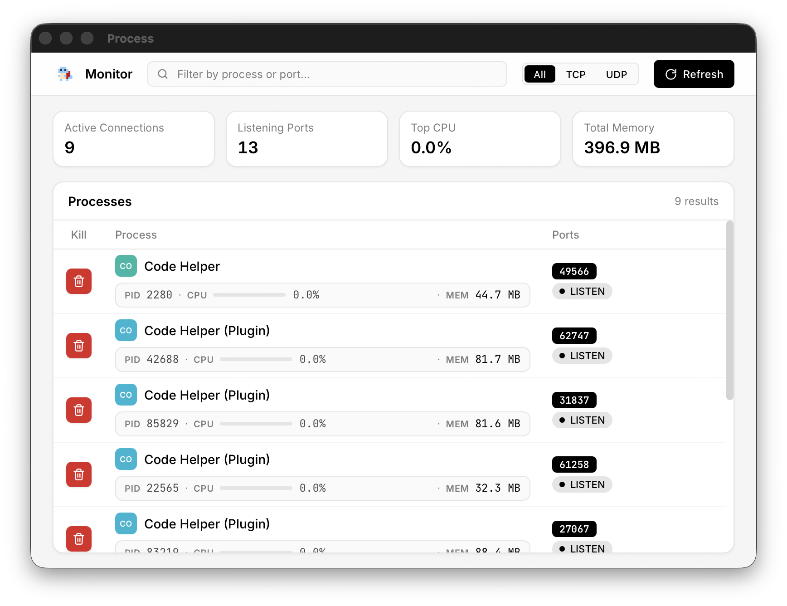

# Process



**Process** is a real-time desktop application built with Rust and Tauri v2 for monitoring and managing system processes that have active network port listeners.

## Features

- **Port-Only Filtering**: Automatically filters out system noise to show only processes with active network connections (ideal for tracking local servers like Node.js, Python, or Nginx).
- **One-Click Termination**: Instantly kill any process directly from the dashboard.
- **Clean Light UI**: A data-dense, distraction-free design with process avatars, CPU bars, port badges, and state indicators.
- **Protocol Toggle**: Filter processes by All / TCP / UDP directly from the toolbar.
- **Real-Time Stats**: Live stats strip showing active connections, listening ports, top CPU, and total memory.
- **Real-Time Updates**: Automatically refreshes the process list every 5 seconds.

## Downloads

Get the latest version for your platform from the [GitHub Releases](https://github.com/its-ash/network-process/releases) page.

## Tech Stack

- **Backend**: [Rust](https://www.rust-lang.org/) & [Tauri v2](https://tauri.app/)
- **Frontend**: Vanilla JavaScript & CSS (light, card-based design system)
- **Monitoring**: `sysinfo` (Rust) & `lsof` (macOS/Unix) / `netstat` (Windows)
- **Fonts**: Inter & JetBrains Mono

## Getting Started

### Prerequisites
- [Rust](https://www.rust-lang.org/tools/install)
- [Node.js](https://nodejs.org/) (LTS)
- [Tauri CLI](https://tauri.app/v2/guides/getting-started/prerequisites)

### Development
1. Clone the repository and install dependencies:
   ```bash
   npm install
   ```
2. Run the application in development mode:
   ```bash
   make run
   ```

### Build
```bash
make build
```

### Deploy
Builds, commits, pushes to `main`, and creates a GitHub release with bundled artifacts:
```bash
make deploy
```

## Troubleshooting (macOS)

If you encounter issues running the application on macOS (e.g., "damaged and can't be opened"), it might be due to macOS quarantine.

Try checking the attributes:
```bash
xattr -l /path/to/application.app
```

If `com.apple.quarantine` is listed, you can remove it with:
```bash
xattr -dr com.apple.quarantine /path/to/application.app
```
You might want to remove other attributes it returns as well.

## License
MIT
